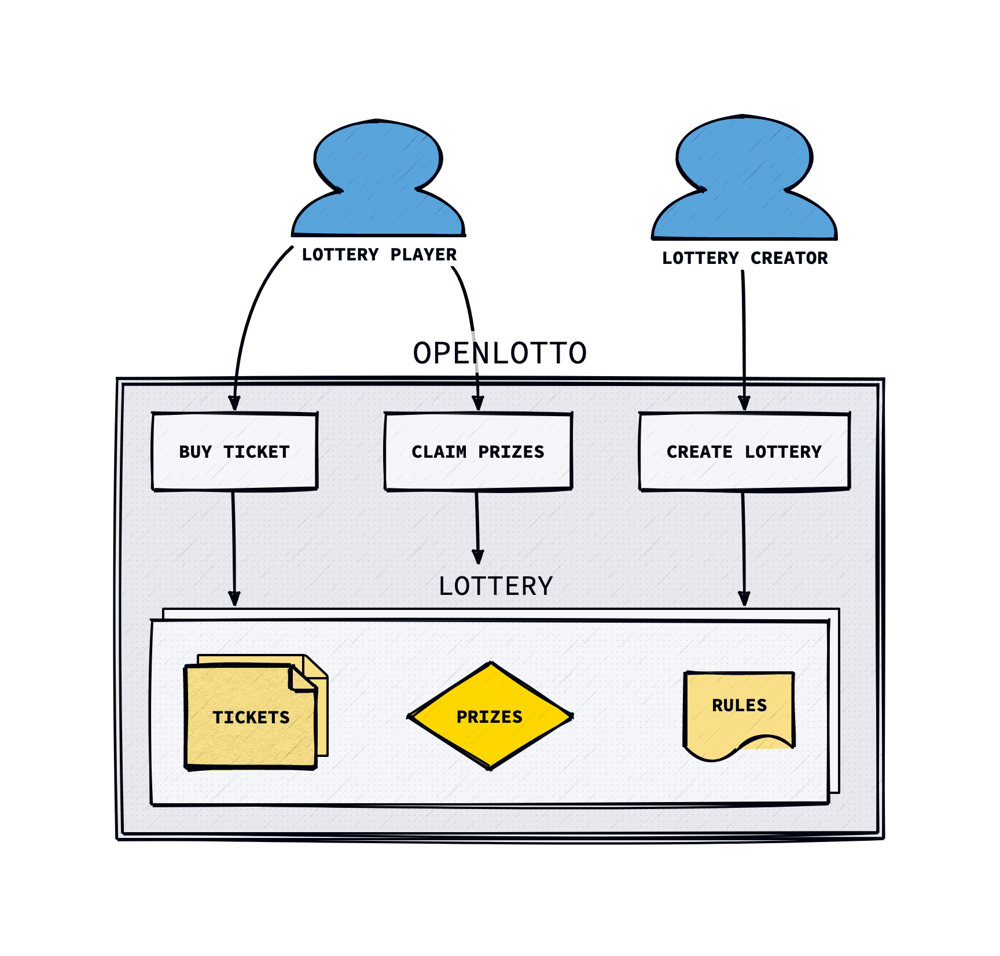

# OpenLotto - An Open-source Blockchain-based Lottery Platform

[](https://opensource.org/licenses/MIT)

## Table of Contents

## Introduction

### What is OpenLotto?

OpenLotto is an open-source blockchain-based lottery platform with focus on transparency, security and fairnes.


### How does it work?

OpenLotto leverages the smart contracts to create a tamper-proof and auditable lottery system, where lottery creators and players can interact in a tamper-proof and auditable environment. This ensures that the lottery rules are adhered to by all parties involved, from the creation of the lottery, the purchase of tickets, the drawing of the winners, to the distribution of the prizes. 



## Features

- **Decentralization**: OpenLotto operates on a decentralized blockchain network, harnessing the power of distributed consensus to eliminate the need for trust in a central authority.

- **Transparency**: All lottery transactions and outcomes are recorded on the blockchain, creating an immutable and publicly accessible ledger. This transparency enables players to audit and verify the entire lottery process.

- **Security**: The utilization of blockchain technology ensures the immutability of lottery data, making it tamper-resistant and highly secure. Each transaction and decision is cryptographically linked, creating an unbreakable chain of trust.

- **Fairness**: OpenLotto sticks to fairness by leveraging transparency to empower lottery players to independently verify the selection process for winners on a equitable gaming environment.

- **Extensible**: OpenLotto is extensible to enable the creation of various types of lotteries with with a wide spectrum gameplay mechanics.


## Architecture

The architecture of OpenLotto revolves around three fundamental concepts, each encapsulated within a distinct smart contract. This design promotes both the flexibility and extensibility of the platform.

### Interface

The **Interface** serves as the primary gateway for interactions with OpenLotto, the Interface offers administrative functions for lottery creation, ticket purchasing, and prize claiming. Additionally, it integrates the ERC721 standard, allowing tickets to be treated as NFTs (Non-Fungible Tokens).

- `CreateLottery`: Creates a new lottery with specified atributes. Only users with the LOTTERY_MANAGER_ROLE can call this function.

- `ReadLottery`: Retrieves details of a specific lottery.

- `BuyTicket`: Enables users to purchase a lottery ticket by providing the necessary ticket details and sending the appropriate amount of Ether.

- `ReadTicket`: Retrieves details of a specific ticket.

- `TicketPrizes`:Get the list of prizes for a given ticket in a specific round.

- `WithdrawTicket`: Allows ticket holders to withdraw their winnings for a given ticket in a specific round.

### Lottery Operator

The **Lottery Operator** houses the logic tailored to different types of lottery games. By segregating the game-specific logic into separate operator contracts, OpenLotto can support a wide variety of lottery types without cluttering the main interface.

### Data 

The **Data** stores all data related to lotteries, including the configuration and rules associated to the Lottery Operator, as well as the details of tickets purchased by participants. 

#### Lottery Data Model

The Lottery data model serves as the backbone of individual lottery instances within the platfirm, providing a foundation for creating and managing diverse types of lotteries.

Attributes of the Lottery data model include:

- `Name`: Human-readable identifier for the lottery.
- `InitBlock`: Block number at which the lottery rounds are initialized or started.
- `Rounds`: Number of rounds or iterations for the lottery (how many times the lottery will be played).
- `RoundBlocks`: Number of blocks between each round.
- `BetPrice`: Cost of a single bet for the lottery.
- `JackpotMin`: Minimum size of the lottery jackpot.
- `DistributionPoolTo`: Destination for the distribution pool entries. (address(0) sends money to the reserve, remaining value goes to the jackpot).
- `DistributionPoolShare`: Share (%) for the distribution pool entries.
- `PrizePoolShare`: Share (%) for the prize pool entries.
- `ProzePoolAttributes`: Atributes for the operator to process the prize pool entries.
- `Operator`: Contract that 'operates' this lottery.
- `Attributes`: Attributes for the operator.

#### Ticket Data Model

The Ticket data model represents an individual lottery ticket purchased by a participant, functioning as a vital element for tracking and validating user participation in lotteries. Tickets play a crucial role in verifying and awarding prizes to deserving winners.

Attributes of the Ticket data model include:

- `LotteryID`: Reference identifier of the lottery associated with the ticket.
- `LotteryRoundInit`: Starting round of the lottery for which the ticket is playing.
- `LotteryRoundFini`: Ending round of the lottery for which the ticket is playing.
- `NumBets`: Number of bets the ticket is processing (typically 1). The ticket cost and prize are affected by this value.

## Donations

If you find OpenLotto valuable and would like to support its development and maintenance, you can contribute through donations. Here are several ways you may do so:

- **Bitcoin (BTC)**: _TBD_
- **Ethereum (ETH)**: _TBD_

Thank you ❤️ for considering to donate to me. Your contributions will go a long way in helping us continue to improve and expand the capabilities of the platform.

## Setup

### Dependecies
- Foundry
```
$ curl -L https://foundry.paradigm.xyz | bash
$ source ~/.bashrc
$ foundryup
```
### Clone
```
$ git clone --recurse-submodules https://github.com/apuigsech/openlotto-contracts.git
```
### Install Libs
```
$ forge install
```
### Build 
```
$ forge build
```
### Test
```
$ forge test
```
### Deploy (Local)
```
$ anvil
$ forge script script/DeployOpenLotto.s.sol --tc DeployOpenLotto --rpc-url http://127.0.0.1:8545 --broadcast
```